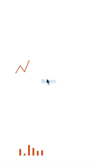

[](https://cocoapods.org/pods/EasyChart)


# Purpose 
To get simple chart view easily like Line-chart or Bar-chart. 
You can drag on chart in order to see specific data.




## Requirements
iOS 13.0

## Installation

EasyChart is available through [CocoaPods](https://cocoapods.org). To install
it, simply add the following line to your Podfile:

```ruby
pod 'EasyChart'
```


# Usage 

In order to create ``EasyChart``, first of all you should have data array conforming ``EasyChartObjectProtocol``. 
- ``value`` is meaning each line height.  this should need.
- ``row``is meaning each line bottom name. this is optional. 

```swift
public protocol EasyChartObjectProtocol {
    var value: CGFloat { get set }
    var row: String? { get set }
}
```
Or you can just make ``Object`` already made in project conforming ``EasyChartObjectProtocol``

then just create EasyChartView with data. 
chart default is ``.lineChart``, so if you want Bar-chart , you just set ``.barChart`` in inlitialize
- you can set frame or constraint. 
- you can set normal chart color, touched chart color with ``UIColor`` you want   by creating ``EasyChartColor``. 
- if you want chart not to be animated, set false in ``isAnimated`` in ``EasyChartView initializer``. Default is ``true``.


```swift 
import EasyChart 
...
let data: [EasyChartObjectProtocol] = [] 
let easyChartView = EasyChartView(objects: data )
let easyChartView = EasyChartView(frame: CGRect.zero, chart: .barChart, objects: data )
let easyChartView = EasyChartView(frame: CGRect.zero, objects: data )
let easyChartView = EasyChartView(frame: CGRect.zero, objects: data, color: EasyChartColor() )
let easyLineChartView = EasyChartView(objects: data, isAnimated: false)
...
view.addSubview(easyChartView)
```
you can again draw chart with animation. 

```swift
easyChartView.drawChart()
```

you can set color you want.

```swift
easyChartView.chartColor = UIColor.red
easyChartView.touchedChartColor = UIColor.red
```

Also, you can see that process in ``DemoApp`` project. 


## Author

gustn3965, gustn3965@gmail.com
